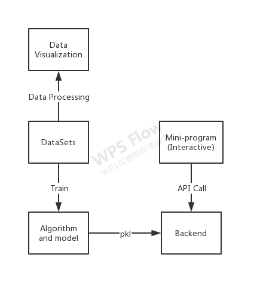
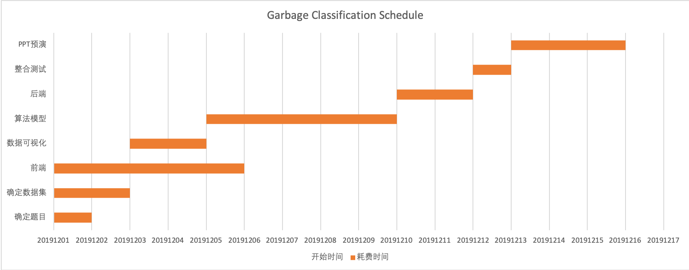

# Garbage Classification

## Todo

* [ ] 市场调研
  * 产品
  * 算法
* [ ] 算法模型（存储）
  * 手机
    * mobileNet v3（分类模型）
    * yolo v3（目标检测模型）
  * 服务器
    * resnet
    * denseNet
* [ ] 项目原型
  * 前端（两个人）
* [ ] 确定数据集
  * label的范围（4类）
  * 特征划分（思维导图）
* [ ] 数据可视化（整个阶段）
  * 特征权重
  * 模型评估
* [ ] 架构图
  * 整体
  * 模块

## Flow

## Schedule

## DataSets

* https://storage.googleapis.com/openimages/web/download.html

## Application Scenarios

* Mini-program
* Take-out APP
  * 外卖垃圾，用户吃完后，自动分类，扔掉
  * 美团一天有2000多万单，饿了么一天大约1800w单
  * [美团青山计划](https://baike.baidu.com/item/%E9%9D%92%E5%B1%B1%E8%AE%A1%E5%88%92/22917297?fr=aladdin)，提出的科学环保闭环，沿着这条商业路线，如何做好垃圾图片数据标注？

## [Log](./log.md)

## References

* [深度学习（1）—从ImageNet下载图片](https://blog.csdn.net/weixin_42364977/article/details/82822026)
* [weiaicunzai/awesome-image-classification](https://github.com/weiaicunzai/awesome-image-classification)
